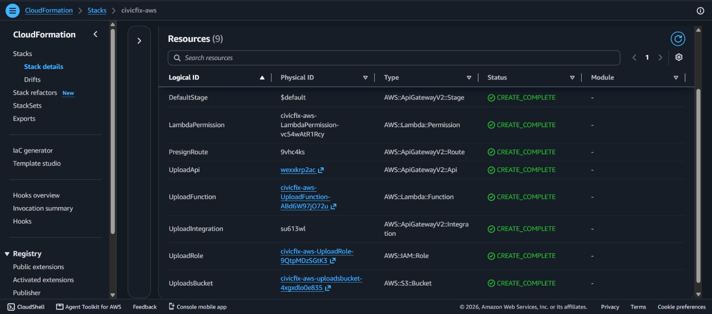
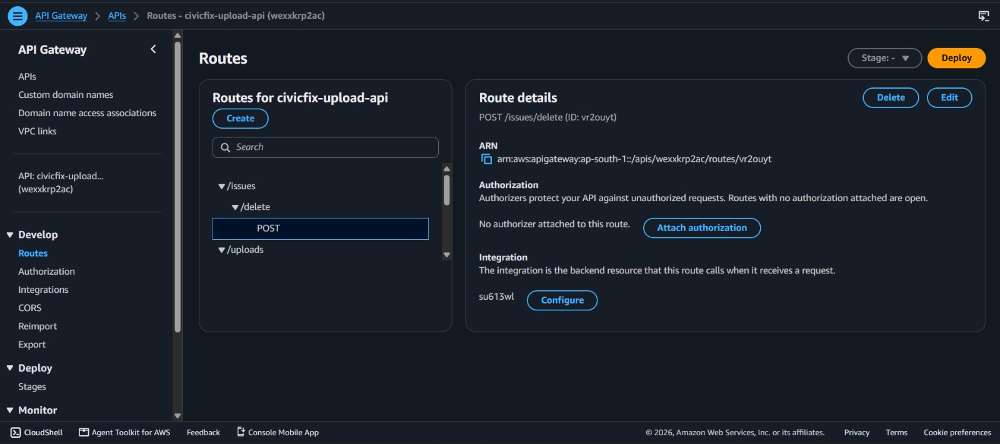
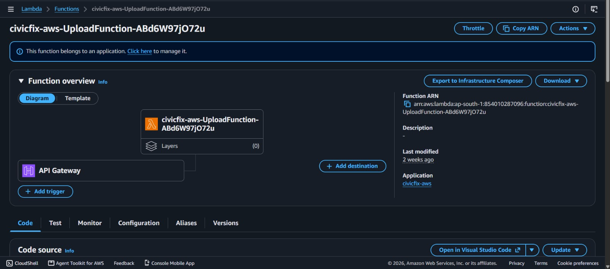
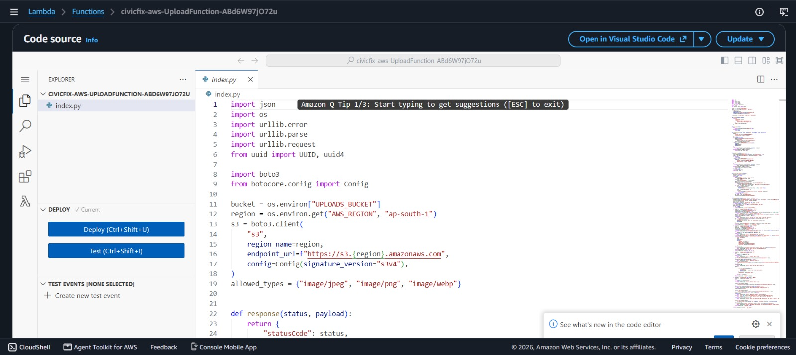
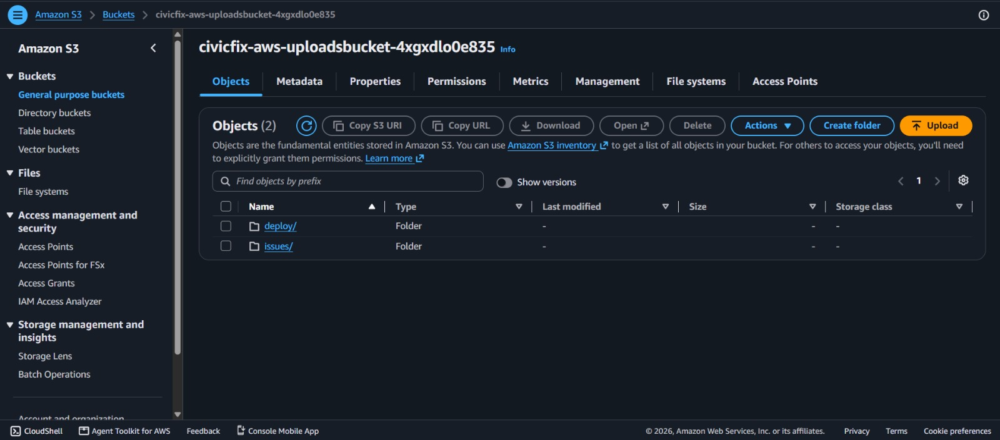
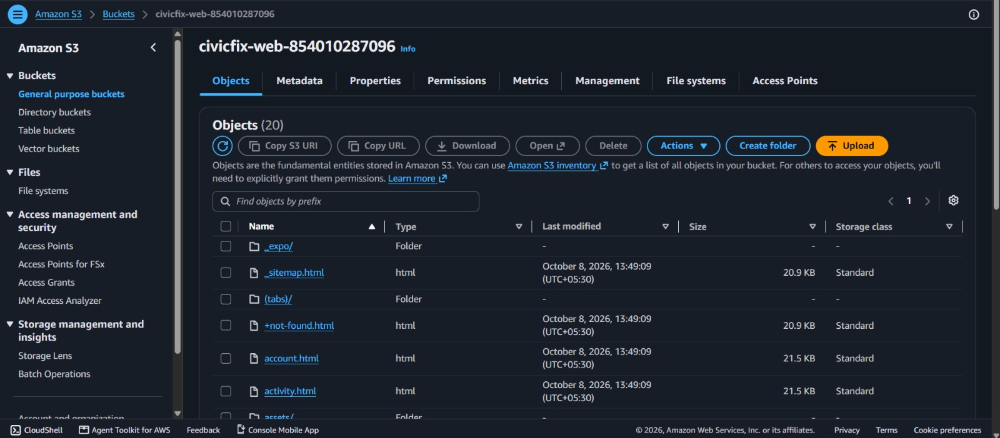
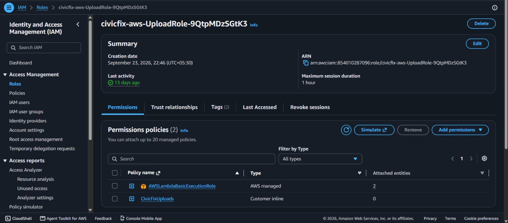
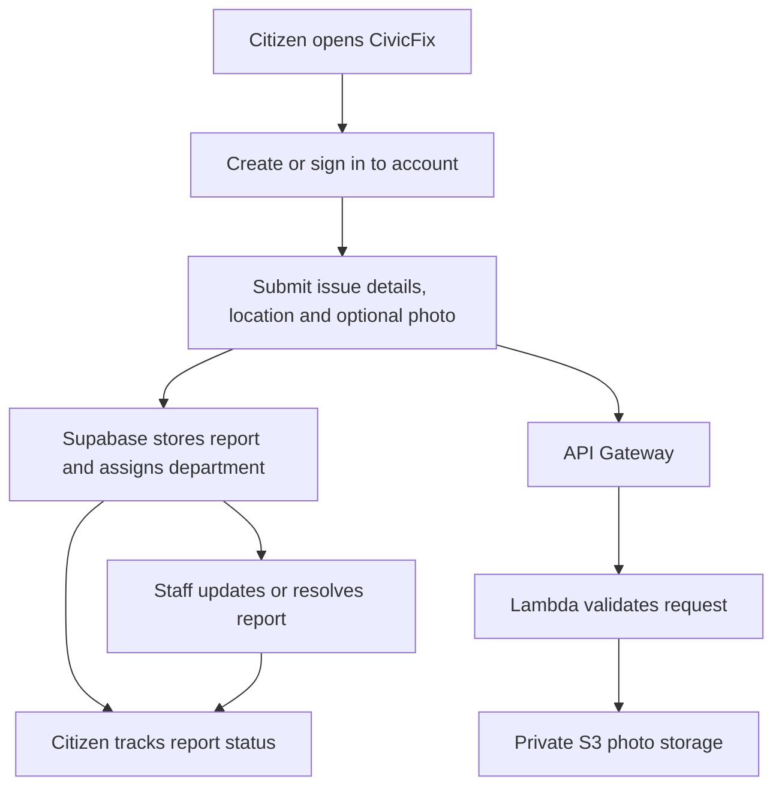

# CivicFix

CivicFix is a mobile-first app for reporting local civic problems, tracking their progress, and helping departments manage their work queue.

## How the app works

1. A citizen creates an account and reports an issue with a category, description, location, and optional photo.
2. The report is stored in Supabase and assigned to the relevant department.
3. If a photo is included, the app requests a secure upload link and saves the photo privately in AWS S3.
4. Citizens can follow report status updates, while staff can update, resolve, or delete assigned reports.

## AWS services used

### AWS CloudFormation

CloudFormation deploys and manages the CivicFix AWS resources.

### Amazon API Gateway

API Gateway exposes secure HTTP endpoints for photo upload, completion, viewing, and deletion.

### AWS Lambda

Lambda validates requests, creates short-lived S3 presigned URLs, and handles photo-related API operations.

### Amazon S3

S3 stores civic issue photos privately. A separate S3 bucket hosts the public web build.

### AWS IAM

IAM provides the Lambda execution role and only the S3 permissions required for uploads and photo management.

## App demo

1. Open CivicFix and create an account or sign in.
2. Tap **Report** and select an issue category.
3. Enter the problem details and location, then optionally add a photo.
4. Submit the report and note the generated reference number.
5. Open **My Reports** to track the status and updates.
6. Sign in as staff to open the department workspace and update the report status.

## Flow chart

